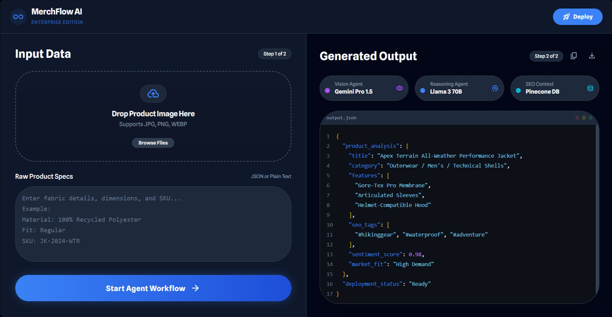

# MerchFlow AI

> An autonomous multi-agent system that generates SEO-optimized e-commerce listings from product images.


## The Architecture 🏗️

MerchFlow AI utilizes a sophisticated multi-agent workflow to transform static product images into high-converting sales listings:

*   **👀 Visual Analyst**: Leverages **Gemini 1.5 Pro** to analyze product images, identifying key features, styles, and aesthetic nuances.
*   **🧠 Memory Agent**: Consults a **Pinecone Vector DB** to retrieve high-performing SEO keywords and market trends relevant to the visual analysis.
*   **✍️ Writer Agent**: Utilizes **Llama 3** (via Groq) to synthesize visual data and market insights into compelling, SEO-optimized sales copy.

## Tech Stack 💻

*   **Backend Framework**: FastAPI
*   **Styling**: Tailwind CSS
*   **Language**: Python
*   **Containerization**: Docker
*   **AI/ML**: Google Gemini, Meta Llama 3, Pinecone

## Installation & Setup 🛠️

Clone the repository to your local machine:

```bash
git clone https://github.com/your-username/merchflow-ai.git
cd merchflow-ai
```

Install the required dependencies:

```bash
pip install -r requirements.txt
```

## Configuration ⚙️

Create a `.env` file in the root directory and add your API keys:

```ini
GROQ_API_KEY=your_groq_api_key
PINECONE_API_KEY=your_pinecone_api_key
GOOGLE_API_KEY=your_google_api_key
```

## Run 🚀

Launch the efficient multi-agent system:

```bash
python launcher.py
```

## Demo 📸



## License 📄

This project is licensed under the MIT License - see the [LICENSE](LICENSE) file for details.
